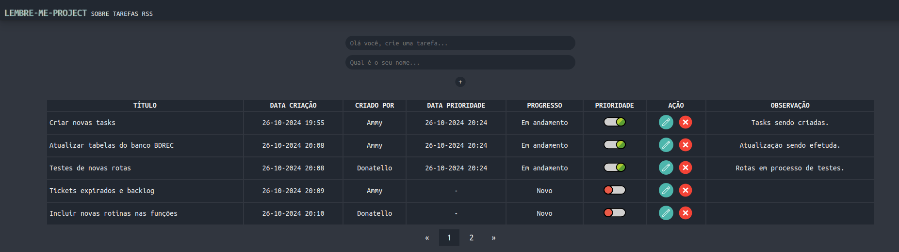

# Lembre-Me
O Lembre-me é uma agenda para suas tarefas e projetos, salve e acompanhe o andamento até sua conclusão.



Faça o clone do repositório em sua máquina local, navegue até a raiz da pasta e siga o passo a passo abaixo:

## Como iniciar a aplicação:

### 1. Crie o ambiente virtual
```
$ python -m venv env
```

### 2. Agora inicie o ambiente:
```
$ source env/bin/activate
```

### 3. Instale as bibliotecas necessárias e crie o arquivo .env na raiz onde será declarada a variável SECRET_KEY:
```
$ (env) pip install -r requirements.txt
```

### 4. Execute seu aplicativo no browser (http://localhost:5000):
```
$ (env) python app.py
```

### Contribuição:
Caso queira contribuir com esse projeto abra um PR com sua contribuição.
