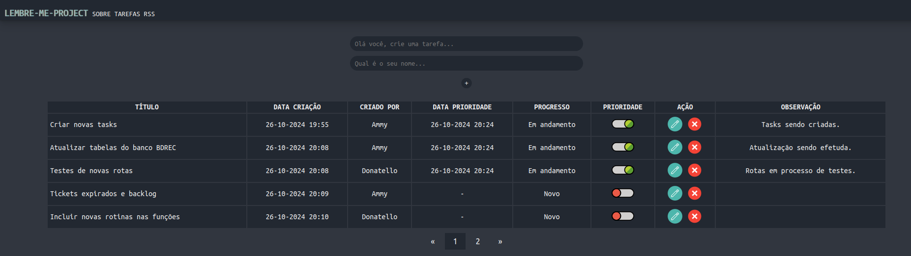

## lembre-me

O ***lembre-me*** é uma agenda para suas tarefas e projetos, salve e acompanhe o andamento até sua conclusão.



Faça o clone do repositório em sua máquina local, navegue até a raiz da pasta e siga o passo a passo abaixo:

#### Iniciando a aplicação:

1. crie o ambiente virtual

``` $ python -m venv env ```

2. inicie o ambiente:

``` $ source env/bin/activate ```

3. instale as bibliotecas necessárias e crie o arquivo .env na raiz onde será declarada a variável SECRET_KEY:

``` $ (env) pip install -r requirements.txt ```

4. execute seu aplicativo no browser (http://localhost:5000):

``` $ python app.py```

### Contribuição:
Contribua com esse projeto abrindo um PR com sua contribuição.